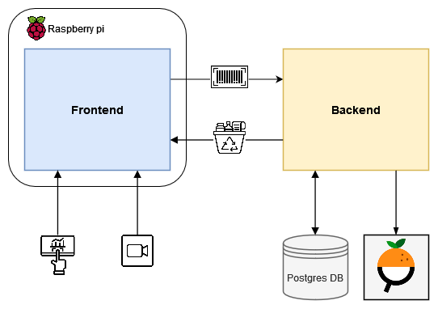

# mus-diesenreiter-stadler

Welcome to WasteWizard!

Make a difference and reduce waste with our innovative app. WasteWizard is your go-to tool for scanning barcodes and discovering how to dispose of items properly. With just a few taps, you can contribute to a cleaner environment and promote sustainable living.

 
 

## Architecture

The application comprises a frontend connected to a corresponding server, providing users with a graphical user interface (GUI) for seamless interaction with the system. The frontend captures camera data and performs barcode scanning. The barcode information is then transmitted to the backend via a GET request. The backend utilizes the barcode information to search for the corresponding product within its proprietary database or retrieves data from the Open Food Facts API. The product information includes packaging details, which are mapped to recycling information and returned as a response to the frontend. The GUI presents the packaging information to the user for easy accessibility and reference.

 
 

## Implementation and Usage Guides

[Frontend](recycling-frontend/README.md)

[Server](recycling-server/README.md)
