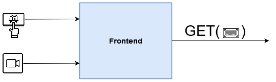

# Recycling Frontend

The module utilizes a combination of computer vision, barcode decoding, and data retrieval to provide users with recycling and packaging information.

## Prerequisites
We recommedn using [PyCharm](https://www.jetbrains.com/de-de/pycharm/) as an IDE. 

Fruthermore, ensure that you have the following dependencies installed:
- Python (version 3.6 or above)
- OpenCV (cv2)
- imutils
- PIL (Python Imaging Library)
- pyzbar
- requests
- tkinter
- ttk

### Getting Started
1. Ensure that the required dependencies are installed using pip or any other package manager you prefer.
2. Adjust the video capture settings (vid_width and vid_height) according to your camera's specifications if necessary.
3. Run the main Python script, [main.py](main.py).

### Functionality
Upon launching the frontend, the application window will open, featuring a graphical user interface (GUI) with a "Scan barcode" button and an information label. Here's how the application works:

1. Click the ```Scan barcode``` button: This will initiate the barcode scanning process.
2. Aim the camera at the barcode: Place the item with the barcode in front of the camera and ensure that it is visible within the frame.
3. Scanning process: The application captures video frames from the camera, detects barcodes, and decodes the barcode data using the ```pyzbar library```.
4. Barcode identification: If a barcode is successfully detected, WasteWizard retrieves recycling and packaging information associated with the barcode from the backend server.
5. Display of information: The GUI updates to display the product's name, recycling information, and packaging details. An image of the product, if available, is also shown.
6. Scan again or exit: Once the information is displayed, you can either click the ```Scan barcode``` button again to scan another item or exit the application.




### Modifying the Backend and API
By default, WasteWizard is set to retrieve data from a backend server hosted on http://localhost:8080/product. If you have a different backend server or API endpoint, you can modify the `retrieve_data()` function to use the appropriate URL.

### Customization
You can customize WasteWizard by adjusting various parameters within the code:
- vid_width and vid_height: Set the desired width and height for video frame capture.
- screen_width and screen_height: Define the dimensions of the application window.
- img_width and img_height: Specify the size of the image display area within the GUI.
- info_label_width: Control the width of the information label in characters.
- t1 and t2: Modify the text displayed in the welcome message and scanning prompts.

### Known Limitations
- WasteWizard is currently designed to work with webcams or camera devices connected to the local machine. For other devices or setups, modifications to the video capture code may be necessary.
- The availability and accuracy of recycling and packaging information depend on the backend server or Open Food Facts API.
- Barcode scanning may be affected by lighting conditions, image quality, or barcode types not supported by the pyzbar library.


