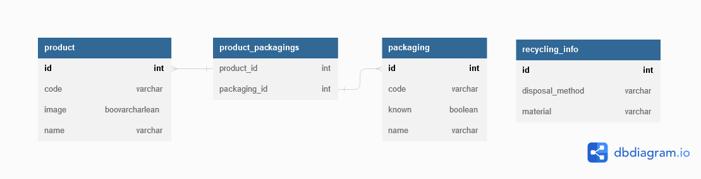

# Recycling Server

## DB Schema




## Deployment 

Make sure you have a postgres database up and running, you can run the following command:
```
docker run --name postgres -p 5432:5432 -e POSTGRES_USER=postgres -e POSTGRES_PASSWORD=postgres -e -d postgres
```


## Testing
You can query the api using http://localhost:8080/product?barcode=3017620422003, it will fetch you some info on Nutella.
 